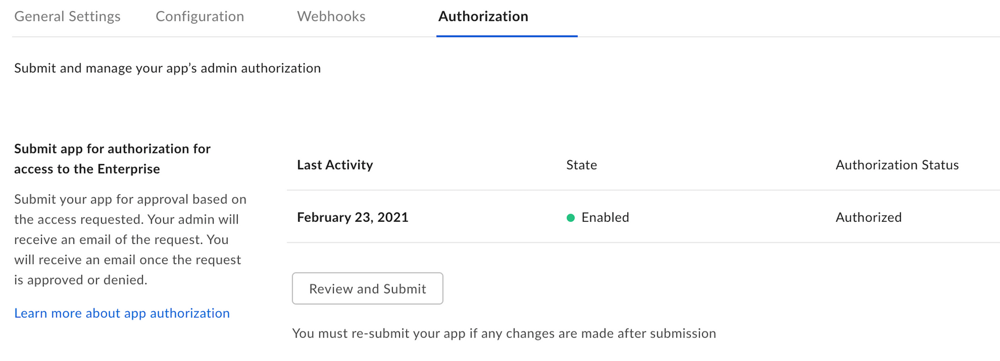

# (付録) JWT認証を使用したBox CLI

これまで、[Box CLIのクイックスタートガイド][qs]では、JWTアプリケーションまたはサーバー認証アプリケーションの設定フローについて説明してきましたが、新しくOAuth 2.0バージョンのBox CLIをリリースしたため、新機能の使用についてガイドを更新しました。当初のJWTの設定手順については、引き続きサーバー認証アプリケーションを使用したい方のために、こちらに移動しました。

## JWTアプリケーションの設定

サーバー認証を使用したCLIを使用するには、まず、[開発者コンソール][dc]でBoxアプリケーションを作成します。CLIはAPI呼び出しを実行する際にバックグラウンドでこのアプリケーションを使用できます。CLIを既存のJWTアプリケーションに関連付ける場合は、この手順を省略できます。ただし、少なくとも、以下のスコープがアプリケーションの \[**構成**] タブで設定されていることを確認してください。

* Boxに格納されているすべてのファイルとフォルダの読み取り
* Boxに格納されているすべてのファイルとフォルダへの書き込み

1. \[すべてのファイル] ページの左側にあるナビゲーションパネルから、[開発者コンソール][dc]を開きます。今回Box APIを使用するのが初めてで、このオプションがまだ使用できない場合は、[こちら][dc]をクリックするとこのオプションをアカウントに追加できます。

2. \[**アプリの新規作成**] > \[**カスタムアプリ**] > \[**サーバー認証 (JWT使用)**] の順にクリックし、アプリケーションに名前を付けて、\[**アプリの作成**] をクリックします。

<Message warning>

サーバー認証 (JWT使用) は、使用する前に必ず管理者の承認が必要になります。

</Message>

## アプリケーションの構成

これにより、アプリケーションの設定ページが表示され、そこで、そのアクセスや権限を選択する必要があります。アプリケーションの認証タイプが原因で、管理者の承認が必要になることにもう一度注意してください。

少なくとも、以下の[スコープ][scopes]が必要です。

* Boxに格納されているすべてのファイルとフォルダの読み取り
* Boxに格納されているすべてのファイルとフォルダへの書き込み

[アプリケーションアクセス][aa]として、\[アプリアクセスのみ] または \[アプリ + Enterpriseアクセス] のいずれかを選択できます。

## アプリケーションの承認

API呼び出しを正常に実行する前に、サーバー認証を利用するすべてのアプリケーションを管理コンソールで承認する必要があります。これは、すべてのJWTアプリケーションには[サービスアカウント][sa]があるためです。サービスアカウントは、アプリケーションの[スコープ][scopes]に基づいて管理者アクションを実行できます。

開発者と管理者向けの手順については、Boxの[承認ガイド][ag]を参照してください。

スコープ、アプリケーションアクセス、トークン、権限がどのように連携しているかの詳細については、[Boxのセキュリティメカニズム][blogpost]に関する記事を参照してください。

<Message warning>

設定の変更がこのアプリケーションに対して行われた場合は、その変更を有効にするためにこのアプリケーションを再承認する必要があります。

</Message>

アプリケーションが使用できる状態になっているかどうかを確認するには、[開発者コンソール][dc]の \[承認] タブを表示します。状態とステータスはそれぞれ、\[有効] と \[承認済み] になっているはずです。

<ImageFrame center>



</ImageFrame>

## 必要なデータのダウンロード

CLIでは、API呼び出しを実行するために、ローカルに保存されている構成ファイルが必要です。

構成ファイルをダウンロードするには、[開発者コンソール][dc]の \[**構成**] タブにアクセスし、\[**公開/秘密キーペアを生成**] をクリックします。これにより、アプリケーションの構成ファイルを自動的にダウンロードする前に2FA認証が行われます。詳細については、Boxの[ガイド][keypair]を参照してください。

<Message warning>

セキュリティ上の理由により、公開/秘密キーペアを生成するには、Boxアカウントで2FAを有効にする必要があります。

</Message>

`EnterpriseID_publicKeyID_config.json`という形式のデフォルトの名前が付いているダウンロード済みファイルをコンピュータ上で探します。この名前をそのまま使用しても、変更してもかまいません。このガイドでは、ファイルの名前を`config.json`に変更することを想定しています。

<Message warning>

誤って削除または移動されることがない場所にファイルを配置することが重要です。ファイルが削除または移動された場合は、手順2を繰り返してCLIを再構成する必要があります。

</Message>

## CLIのインストールと構成

Windows用およびmacOS用のインストーラが提供されていますが、その他の環境でCLIを構築する場合はRawソースコードを利用できます。

## Windows用およびmacOS用インストーラ

お使いのマシンに最新のCLIをインストールするには、最新リリースに対応する最新の`.exe` (Windowsの場合) または`.pkg` (macOSの場合) をダウンロードします。

<CTA to="https://github.com/box/boxcli/releases">

最新のCLIインストーラをダウンロード

</CTA>

## LinuxとNodeのインストール

さらに、CLIは、任意のプラットフォーム (Linuxなど) にNodeパッケージとしてインストールすることができます。このためには、[Node JS](https://nodejs.org/)をマシンにインストールしておく必要があります。

```bash
npm install --global @box/cli
```

## ソースコード

CLIのソースコードは、[GitHub][cli]で提供されています。

## 構成コマンドの実行

ここで、手順1でダウンロードした構成ファイルを指すよう、CLIを構成する必要があります。

<ImageFrame center>


</ImageFrame>

<!--alex ignore execute-->

ターミナルまたはコマンドラインを開き、`box configure:environments:add PathToConfigFileHere`コマンドを実行します。ここでは、`PathToConfigHere`を`config.json`ファイルのパスに置き換えます。

<!-- markdownlint-disable line-length -->

例: `box configure:environments:add /Users/ExampleUser/Documents/CLI/config.json`

<!-- markdownlint-enable line-length -->

<message type="tip"></message>

Finder/エクスプローラからターミナル/コマンドラインウィンドウにcsvファイルをドラッグすると、パスを自動で入力できます。

</Message>

## 構成の確認

うまく構成されているか確認するには、コマンド`box users:get`を使用します。

次のように、成功を示すレスポンスには、[アクセストークン][at]に関連付けられた[サービスアカウント][sa]ユーザーの詳細が示されます。

```json
Type: user
ID: ''0123456789''
Name: Box CLI - Quickstart Example
Login: AutomationUser_123456_8jSo6Lqvko@boxdevedition.com
Created At: '2020-01-01T09:45:01-07:00'
Modified At: '2021-03-01T09:30:05-07:00'
Language: en
Timezone: America/Los_Angeles
Space Amount: 999999999999999
Space Used: 6291500
Max Upload Size: 16106127360
Status: active
Job Title: ''
Phone: ''
Address: example+user@box.com
Avatar URL: ''
Notification Email: []
```

<message type="tip"></message>

デフォルトでは、JWTアプリケーションはサービスアカウントのアクセストークンを自動的に取得します。デフォルトユーザーの変更は可能ですが、このガイドでは変更しないことを想定しています。

</Message>

## 次の手順

* コード例をGitHubの[コマンド][commands]ページで確認できます。
* [OAuth 2.0のクイックスタート][three]の2番目の手順に進み、コマンドの使用方法のチュートリアルを確認することもできます。

[cli]: https://github.com/box/boxcli

[auth]: g://authentication/jwt/without-sdk/

[at]: g://authentication/tokens/

<!-- i18n-enable localize-links -->

[dc]: https://account.box.com/developers/console

<!-- i18n-disable localize-links -->

[keypair]: g://authentication/jwt/jwt-setup/#public-and-private-key-pair

[sa]: g://getting-started/user-types/service-account/

[scopes]: g://api-calls/permissions-and-errors/scopes/

[ag]: g://authorization/custom-app-approval/

<!-- i18n-enable localize-links -->

[blogpost]: https://medium.com/box-developer-blog/box-api-understanding-security-ja-b95725d8aaf0

<!-- i18n-disable localize-links -->

[scopes]: g://api-calls/permissions-and-errors/scopes/

[aa]: g://authentication/jwt/jwt-setup/#application-access

[three]: g://tooling/cli/quick-start/build-commands-help/

[four]: g://tooling/cli/quick-start/options-and-bulk-commands/

[cache]: https://github.com/box/boxcli/blob/master/docs/configure.md#box-configureenvironmentsupdate-name

[ac]: https://github.com/box/boxcli/blob/master/docs/autocomplete.md

[commands]: https://github.com/box/boxcli#command-topics

[qs]: g://tooling/cli/quick-start/
